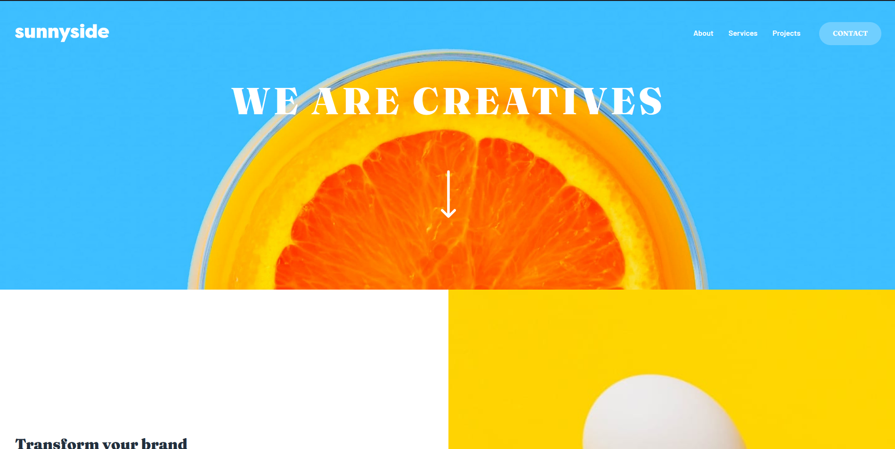

<h1 align="center">☀️ Sunnyside Agency Landing Page</h1>
<p align="center">
  Responsive landing page proposed by <a href="https://www.frontendmentor.io/challenges/sunnyside-agency-landing-page-7yVs3B6ef">Front End Mentor</a>.
</p>
<h2 align="center">
  
</h2>
<p align="center">
  <a href="#tech">Technologies</a> •
  <a href="#objective">Objective</a> •
  <a href="#use">How to Use</a> •
  <a href="#author">Author</a>
</p>

---


<h2 id="tech">🚀 Technologies </h2>

<a href="https://developer.mozilla.org/en-US/docs/Web/HTML" target="_blank">
  
</a>
<a href="https://developer.mozilla.org/en-US/docs/Web/CSS" target="_blank">
  
</a>


<h2 id="objective">🎯 Objective </h2>

<p>This project was proposed by Front End Mentor, you can check the challenge by <a href="https://www.frontendmentor.io/challenges/sunnyside-agency-landing-page-7yVs3B6ef">clicking here</a>. I put in practice the following subjects:</p>
<ul>
	<li>Semantic HTML5 markup</li>
	<li>CSS custom properties</li>
	<li>CSS Grid</li>
	<li>Mobile-first workflow</li>
</ul>
<p>I have plans to add more features in this project as I progress with my studies. Like scroll animations.</p>

<em>User should be able to:</em>
<ul>
	<li>View the optimal layout for the site depending on their device's screen size</li>
	<li>See hover states for all interactive elements on the page</li>
</ul>


<h2 id="use">ℹ️ How to Use </h2>

Before cloning the repository into your machine you'll need: [Git](https://git-scm.com) and [NodeJS](https://nodejs.org/en/). Also it is good to have a code editor like [VSCode](https://code.visualstudio.com/).
```bash
#Clone this repository
$ git clone https://github.com/davyd-souza/sunnyside-agency-landing-page.git sunnyside-agency-landing-page

#Go into the repository
$ cd sunnyside-agency-landing-page

# Install dependencies with 
$ npm install # or
$ yarn

# Run app
$ npm start   # or
$ yarn dev
```


<h2 id="author">👤 Author </h2>

<p>
  Made with 💛 by Davyd Souza </br>
  <a href="https://www.linkedin.com/in/davyd-souza/" target="_blank" alt="LinnkedIn badge">
    
  </a>
  <a href="mailto:davyd.eduardo.souza@hotmail.com" target="_blank" alt="Outlook badge">
    
  </a>
  <a href="https://www.instagram.com/odeisouza/" target="_blank" alt="Instagram badge">
    
  </a>
</p>